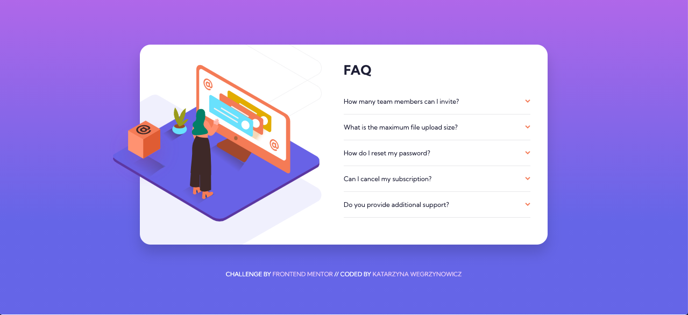

# Frontend Mentor - FAQ accordion card solution

This is a solution to the [FAQ accordion card challenge on Frontend Mentor](https://www.frontendmentor.io/challenges/faq-accordion-card-XlyjD0Oam). Frontend Mentor challenges help you improve your coding skills by building realistic projects. 

## Table of contents

- [Overview](#overview)
  - [The challenge](#the-challenge)
  - [Screenshot](#screenshot)
  - [Links](#links)
- [My process](#my-process)
  - [Built with](#built-with)
  - [What I learned](#what-i-learned)
  - [Useful resources](#useful-resources)
- [Author](#author)

## Overview

### The challenge

Users should be able to:

- View the optimal layout for the component depending on their device's screen size
- See hover states for all interactive elements on the page
- Hide/Show the answer to a question when the question is clicked

### Screenshot

### Links

- Solution URL: [https://github.com/katarzyna-kw/faq-accordion](https://github.com/katarzyna-kw/faq-accordion)
- Live Site URL: [https://katarzyna-kw.github.io/faq-accordion](https://katarzyna-kw.github.io/faq-accordion)

## My process

### Built with

- Semantic HTML5 markup
- CSS properties
- Flexbox
- CSS Grid
- Mobile-first workflow

### What I learned

This is the first time I have used just HTML5 markup and CSS to create an accordion menu versus using Javascript. It was exciting to research about and learn how powerful HTML5 details and summary tags are, as well as how to customize the expand/collapse icons.

### Useful resources

- [CSSTricks](https://css-tricks.com/two-issues-styling-the-details-element-and-how-to-solve-them/) - This article helped me become familiar with the HTML5 details and summary tags.
- [NEWBEDEV](https://newbedev.com/replace-the-expand-icon-of-html5-details-tag) - This was an excellent resource about how to replace the expand icon of the HTML5 details tag.

## Author

- Website - [Katarzyna Wegrzynowicz](https://katarzyna-kw.github.io/portfolio-website/)
- Frontend Mentor - [@katarzyna-kw](https://www.frontendmentor.io/profile/katarzyna-kw)
- Github - [@katarzyna-kw](https://github.com/katarzyna-kw)